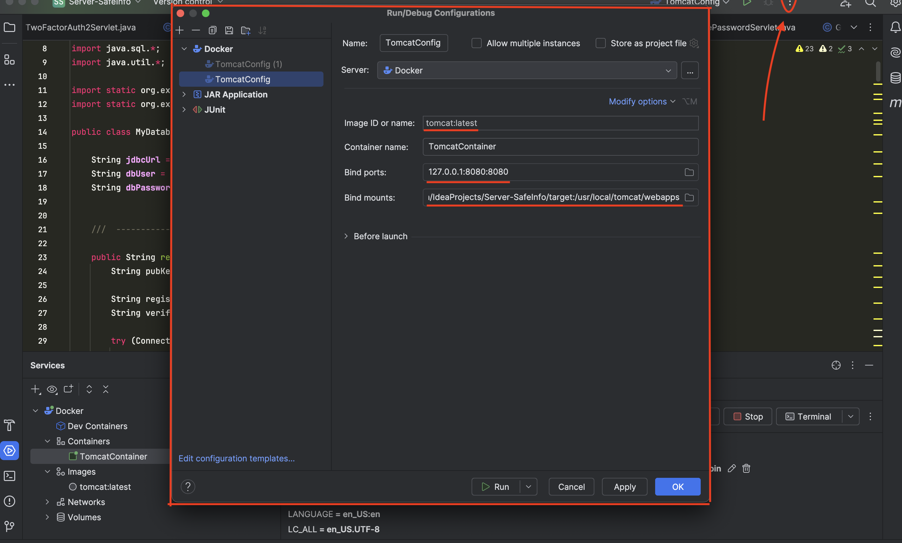
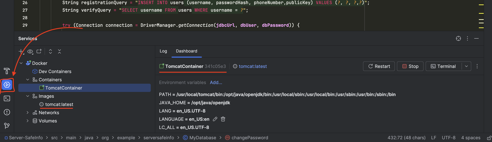

# Installation Guide

- [Client-Side](#client-side)
- [Server-Side](#server-side)

---

### Client-Side

To run the client application, simply open it in **IntelliJ IDEA**.

---

### Server-Side

The server application is built using **Jakarta EE** and requires additional setup since it runs inside a Docker container. Follow the steps below:

---

#### 1. Set Up the MySQL Database

- Download the MySQL database from the [official website](https://downloads.mysql.com/archives/community/). Use **Product Version 9.0.1**.
- Set up the credentials for the root account. The default values are:
  ```
  username: root
  password: rootroot
  ```
*(If you change these credentials, make sure to update them in the `MyDatabase.java` file).*

- Once the connection is established, create the necessary tables using the following SQL commands:
```sql
-- Table for storing user information
CREATE TABLE Users (
    id INT PRIMARY KEY,
    username VARCHAR(20),
    passwordHash VARCHAR(65),
    phoneNumber VARCHAR(14),
    publicKey TEXT NOT NULL
);

-- Table for storing chat logic information
CREATE TABLE Chat (
    chat_id VARCHAR(64) PRIMARY KEY,
    user1 VARCHAR(20),
    ua1 BOOLEAN,
    lastReqTs1 VARCHAR(30),
    user2 VARCHAR(20),
    ua2 BOOLEAN,
    lastReqTs2 VARCHAR(30)
);

```

#### 2. Open the Project in IntelliJ IDEA
- Open the Server-SafeInfo project in IntelliJ IDEA. Make sure the project configuration is correct:



- Run the configuration, and you should see the Docker service running:



- For detailed instructions, refer to the [JetBrains Docker guide](https://www.jetbrains.com/help/idea/docker.html).

#### 3. Adjust the Java JDK Version
- Update the Java JDK version to ensure compatibility:

  - Navigate to `Settings > Build, Execution, Deployment > Compiler > Java Compiler`.
  - Set the **Target bytecode version** to **21**.


#### 4. Insert the Database Driver into the Docker Container
- After the Docker container is created and the server is running, you need to add the MySQL database driver to enable database communication.

- Open a terminal and execute the following commands:

```bash
# Get the container ID
docker ps

# Copy the MySQL database driver into the container
docker cp $HOME/Server-SafeInfo/lib/mysql-connector-j-9.0.0.jar <CONTAINER-ID-HERE>:/usr/local/tomcat/lib
```

#### 5. Verify the Server is Running
- Once the database driver is copied, the server should function as intended.


